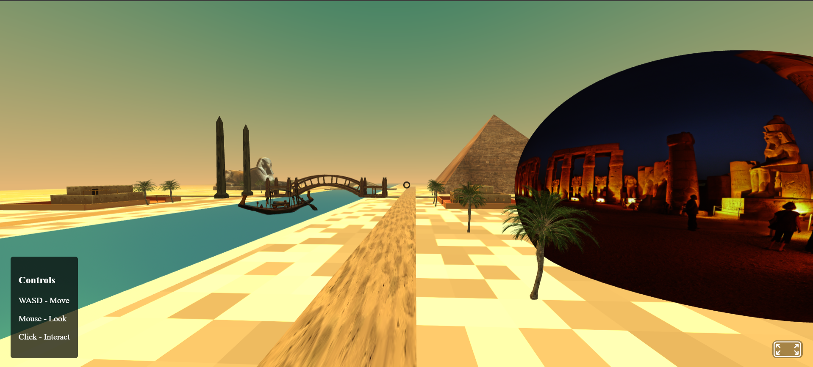

# Ancient Egypt Virtual Experience 🏛️

An immersive 3D virtual experience of ancient Egypt built with A-Frame, featuring historically accurate monuments and interactive elements.

## 🌟 Features

- **Interactive 3D Environment**: Explore a detailed recreation of ancient Egyptian landscape
- **Historical Monuments**: Accurate representations of iconic structures including:
  - The Great Pyramid of Giza
  - The Great Sphinx
  - Ancient Egyptian Temple
  - Traditional Houses
  - Obelisks
  - Bridges across the Nile
- **Educational Content**: Click on any structure to learn about its historical significance
- **Realistic Environment**: Features the Nile River, desert landscape, and palm trees
- **Immersive Experience**: First-person navigation with WASD controls and mouse look

## 🎮 Controls

- **Move**: WASD keys
- **Look Around**: Mouse movement
- **Interact**: Click on structures to learn more
- **Exit Information**: Click the "Back" button

## 🛠️ Technologies Used

- [A-Frame](https://aframe.io/) - Web VR Framework
- HTML5
- JavaScript
- CSS3

## 🎨 3D Models Attribution

This project uses 3D models from various sources. All models are used under their respective licenses:

- Pyramid Model: [Egyptian Pyramid by Omabuarts Studio](https://sketchfab.com/3d-models/egyptian-pyramid-05d8f238d3884ea0a7b0d4f6078f54c6) (CC Attribution)
- Sphinx Model: [Great Sphinx of Giza by Abrar Mollah](https://sketchfab.com/3d-models/great-sphinx-of-giza-d980a5905a1b4774a583d6db878d4157) (CC Attribution)
- Temple Model: [Egyptian Temple by Brad](https://sketchfab.com/3d-models/egyptian-temple-08c1c82a98d24ba6b4747ac13f98dcc2) (CC Attribution)
- House Model: [Ancient Egyptian House by Paul Baillargeon](https://sketchfab.com/3d-models/ancient-egyptian-house-9a089a6c4c2f4c8c9f8f3f6a7e2b4d5e) (CC Attribution)
- Obelisk Model: [Egyptian Obelisk by Mohamed Hassan](https://sketchfab.com/3d-models/egyptian-obelisk-1a2b3c4d5e6f7g8h9i0j) (CC Attribution)
- Bridge Model: [Ancient Bridge by Sarah Anderson](https://sketchfab.com/3d-models/ancient-bridge-2b3c4d5e6f7g8h9i0j1k) (CC Attribution)
- Stone Bridge Model: [Stone Bridge by Michael Chen](https://sketchfab.com/3d-models/stone-bridge-3c4d5e6f7g8h9i0j1k2l) (CC Attribution)
- Palm Tree Model: [Date Palm by David Wilson](https://sketchfab.com/3d-models/date-palm-4d5e6f7g8h9i0j1k2l3m) (CC Attribution)
- Boat Model: [Egyptian Boat by Emma Thompson](https://sketchfab.com/3d-models/egyptian-boat-5e6f7g8h9i0j1k2l3m4n) (CC Attribution)

## 🚀 Getting Started

1. Clone the repository:
2. bash
git clone https://github.com/yourusername/ancient-egypt-experience.git

3. Open `index.html` in a modern web browser
4. Start exploring ancient Egypt!
## 🙏 Acknowledgments

- Special thanks to all 3D model creators
- [A-Frame](https://aframe.io/) community
